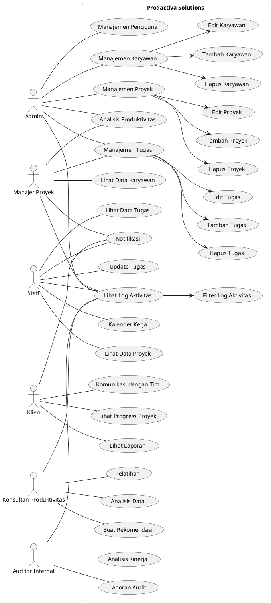

## **Business Requirements Document (BRD)**

### **1. Pendahuluan**
#### **1.1. Latar Belakang**
Prodactiva Solutions adalah perusahaan yang berfokus pada solusi produktivitas untuk bisnis. Aplikasi ini dirancang untuk membantu organisasi mengelola proyek, meningkatkan kinerja tim, dan mencapai target kerja dengan lebih efisien menggunakan teknologi berbasis AI dan platform cloud.

#### **1.2. Tujuan**
- Memberikan solusi manajemen proyek dan tugas yang terintegrasi.
- Meningkatkan produktivitas tim melalui analisis data dan otomatisasi proses.
- Memberikan akses yang aman dan terkelola berdasarkan peran pengguna.

---

### **2. Stakeholder**
#### **2.1. Pengguna**
- **Admin**: Bertanggung jawab untuk mengelola sistem secara keseluruhan.
- **Manajer Proyek**: Bertanggung jawab untuk mengelola proyek dan tugas.
- **Staff/Karyawan**: Bertanggung jawab untuk menyelesaikan tugas yang diberikan.
- **Klien**: Memantau progress proyek dan berkomunikasi dengan tim.
- **Konsultan Produktivitas**: Memberikan rekomendasi berdasarkan analisis data.
- **Auditor Internal**: Memeriksa kepatuhan dan kinerja sistem.

#### **2.2. Tim Pengembang**
- **Product Owner**: Menentukan prioritas fitur dan kebutuhan bisnis.
- **Developer**: Mengimplementasikan fitur dan fungsionalitas aplikasi.
- **QA Engineer**: Melakukan pengujian untuk memastikan kualitas aplikasi.

---

### **3. Fitur Aplikasi**
#### **3.1. Manajemen Karyawan**
- **Tambah Karyawan**: Admin dapat menambahkan data karyawan baru.
- **Edit Karyawan**: Admin dapat mengubah data karyawan yang sudah ada.
- **Hapus Karyawan**: Admin dapat menghapus data karyawan.

#### **3.2. Manajemen Proyek**
- **Tambah Proyek**: Admin dapat menambahkan proyek baru.
- **Edit Proyek**: Admin dapat mengubah data proyek yang sudah ada.
- **Hapus Proyek**: Admin dapat menghapus proyek.

#### **3.3. Manajemen Tugas**
- **Tambah Tugas**: Admin dan Manajer Proyek dapat menambahkan tugas baru.
- **Edit Tugas**: Admin dan Manajer Proyek dapat mengubah data tugas yang sudah ada.
- **Hapus Tugas**: Admin dan Manajer Proyek dapat menghapus tugas.

#### **3.4. Lihat Log Aktivitas**
- **Filter Log Aktivitas**: Admin dan Auditor dapat memfilter log aktivitas berdasarkan kriteria tertentu.

#### **3.5. Analisis Produktivitas**
- **Dashboard Analisis**: Admin dan Manajer Proyek dapat melihat analisis produktivitas tim dan proyek.

#### **3.6. Notifikasi**
- **Notifikasi Deadline**: Admin, Manajer Proyek, Staff, dan Klien menerima notifikasi tentang deadline tugas dan update proyek.

#### **3.7. Kalender Kerja**
- **Jadwal Tugas dan Rapat**: Staff dapat melihat kalender kerja untuk mengatur jadwal tugas dan rapat.

#### **3.8. Laporan**
- **Laporan Proyek**: Klien dapat mengakses laporan hasil proyek.
- **Laporan Audit**: Auditor dapat membuat dan mengakses laporan audit.

---

### **4. Persyaratan Fungsional**
#### **4.1. Login dan Autentikasi**
- Pengguna harus login menggunakan email dan password.
- Sistem harus memeriksa role pengguna setelah login.

#### **4.2. Manajemen Pengguna**
- Admin dapat menambah, mengedit, dan menghapus pengguna.
- Setiap pengguna memiliki role yang menentukan hak aksesnya.

#### **4.3. Manajemen Proyek dan Tugas**
- Admin dan Manajer Proyek dapat menambah, mengedit, dan menghapus proyek dan tugas.
- Staff dapat mengupdate status tugas.

#### **4.4. Analisis Data**
- Admin dan Manajer Proyek dapat melihat analisis produktivitas tim dan proyek.
- Konsultan dapat menganalisis data dan memberikan rekomendasi.

#### **4.5. Notifikasi**
- Sistem mengirim notifikasi otomatis tentang deadline tugas dan update proyek.

---

### **5. Persyaratan Non-Fungsional**
#### **5.1. Keamanan**
- Sistem harus menggunakan enkripsi untuk melindungi data sensitif.
- Setiap pengguna hanya dapat mengakses fitur sesuai dengan role-nya.

#### **5.2. Performa**
- Sistem harus mampu menangani hingga 1.000 pengguna secara bersamaan.
- Waktu respon untuk setiap operasi tidak boleh lebih dari 2 detik.

#### **5.3. Ketersediaan**
- Sistem harus tersedia 24/7 dengan downtime maksimal 1 jam per bulan.

#### **5.4. Skalabilitas**
- Sistem harus dapat diskalakan untuk menambahkan fitur baru atau menangani peningkatan jumlah pengguna.

---

### **6. Use Case Diagram**

---

### **7. Timeline dan Deliverables**
#### **7.1. Timeline**
- **Fase 1 (1 Bulan)**: Pengembangan fitur dasar (Login, Manajemen Karyawan, Manajemen Proyek).
- **Fase 2 (2 Bulan)**: Pengembangan fitur lanjutan (Analisis Produktivitas, Notifikasi, Laporan).
- **Fase 3 (1 Bulan)**: Pengujian dan peluncuran.

#### **7.2. Deliverables**
- Aplikasi web dan mobile.
- Dokumentasi pengguna.
- Laporan pengujian.

---

### **8. Kesimpulan**
Aplikasi Prodactiva Solutions dirancang untuk meningkatkan produktivitas bisnis melalui manajemen proyek dan tugas yang terintegrasi. Dengan fitur-fitur yang disesuaikan untuk setiap peran, aplikasi ini diharapkan dapat memenuhi kebutuhan berbagai stakeholder.

---

Jika ada yang perlu disesuaikan atau ditambahkan, beri tahu saya! 😊

buatin dalam format markdown